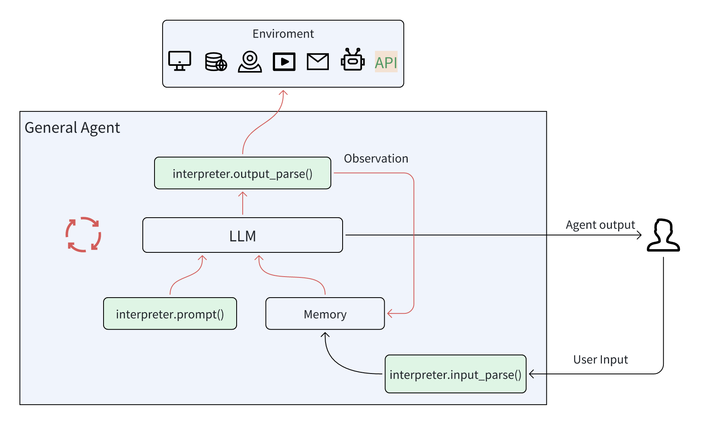
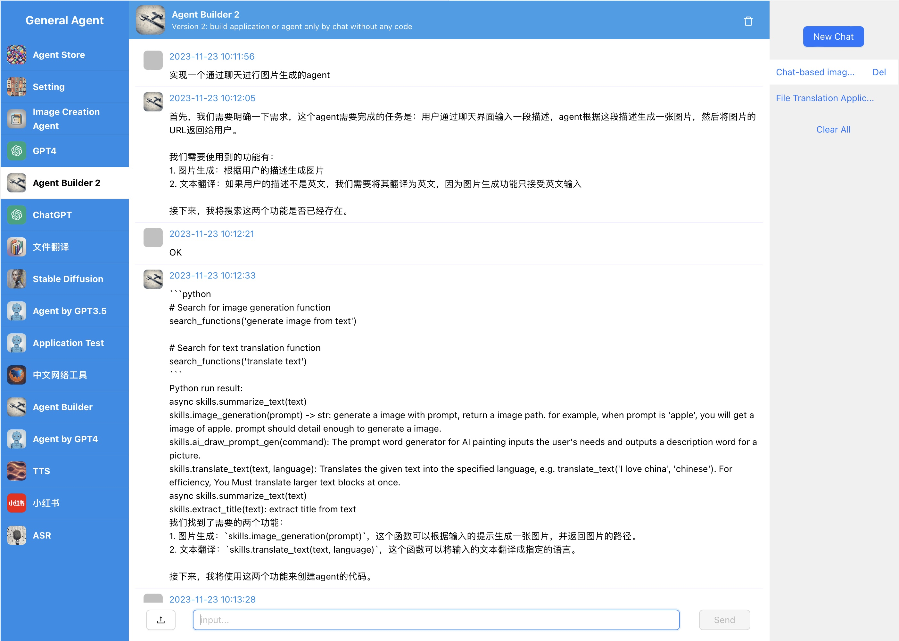
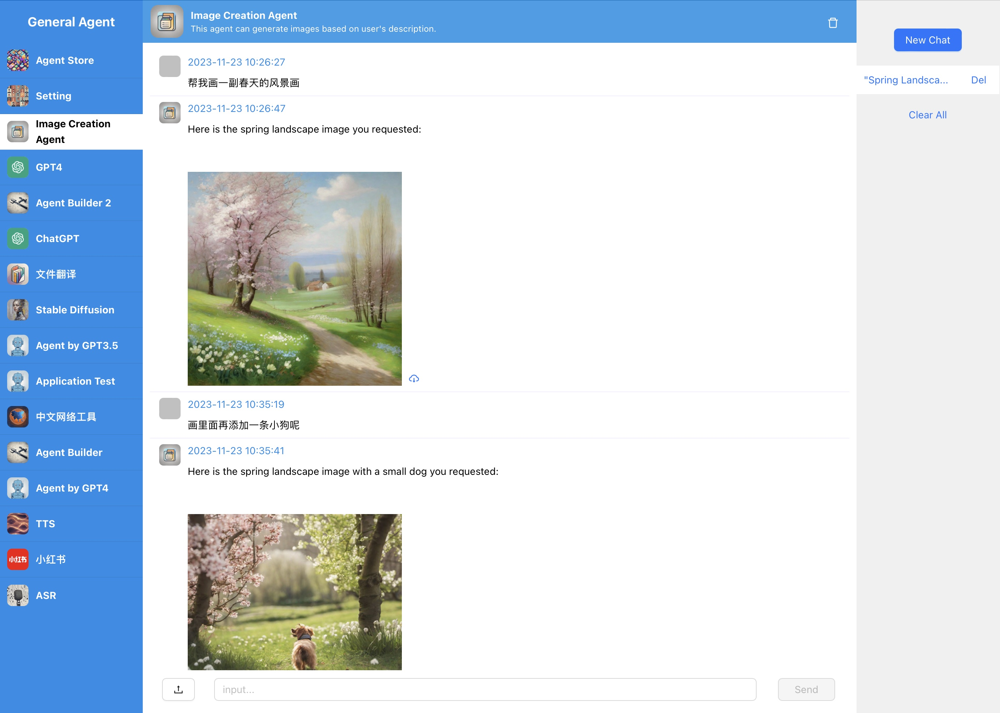
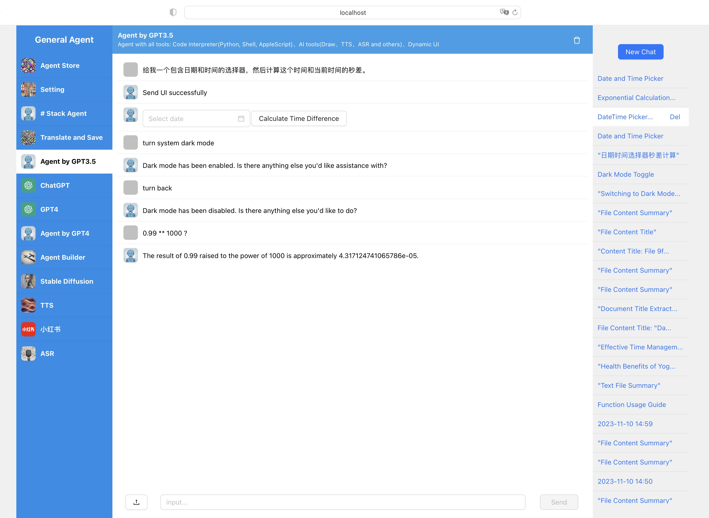

<h1 align="center">GeneralAgent: From LLM to Agent</h1>
<p align="center">
<a href="README.md"></a>
<a href="README_CN.md"></a>

</p>
<p align='center'>
A simple, general, customizable Agent framework
</p>


## Features

* Simple、Fast、Stable: **stable with GPT3.5**.
* GeneralAgent support **serialization**, include **python state**.
* Build-in interpreters: Python, AppleScript, Shell, File, Plan, Retrieve Embedding etc.
* **Dynamic UI**: Agent can create dynamic ui to user who can use.
* **Agent Builder**: Create agents using natural language and use them immediately, without coding.
* [AthenaAgent](https://github.com/sigworld/AthenaAgent) is a TypeScript port of GeneralAgent.


## Architecture

**GeneralAgent**



**WebUI**

<p align="center">

</p>


## Demo

**Version 0.0.11**






**Version 0.03**




**Version 0.0.2**


https://github.com/CosmosShadow/GeneralAgent/assets/13933465/9d9b4d6b-0c9c-404d-87d8-7f8e03f3772b


## Usage

### docker

```bash
# pull docker
docker pull cosmosshadow/general-agent

# make .env
cp .env.example .env
vim .env
# Configure environment variables in the .env file, such as OPENAI_API_KEY, etc.

# run
docker run \
-p 3000:3000 \
-p 7777:7777 \
-v `pwd`/.env:/workspace/.env \
-v `pwd`/data:/workspace/data \
--name=agent \
--privileged=true \
-d cosmosshadow/general-agent

# open web with localhost:3000
```


### Local installation and usage

#### Installation

```bash
pip install GeneralAgent
```

#### Set environment variables

```bash
cp .env.example .env
vim .env
# Configure environment variables in the .env file, such as OPENAI_API_KEY, etc.
export $(grep -v '^#' .env | sed 's/^export //g' | xargs)
```

#### Command line tool

```shell
GeneralAgent
# or
GeneralAgent --workspace ./test --new --auto_run
# worksapce: Set workspace directory, default ./general_agent
# new: if workspace exists, create a new workspace, like ./general_agent_2023xxx
# auto_run: if auto_run, the agent will run the code automatically, default no
```

#### WebUI

```bash
git clone https://github.com/CosmosShadow/GeneralAgent
cd GeneralAgent
# Preparation
cd webui/web/ && npm install && cd ../../
cd webui/server/server/ts_builder && npm install && cd ../../../../
# Start the server
cd webui/server/server/
uvicorn app:app --host 0.0.0.0 --port 7777
# Start the web service
cd webui/web
npm run start
```


#### Python usage

Please refer to the code for usage

* [examples](examples)
* [webui/server/server/applications](webui/server/server/applications)


## Development

* Build, code development and release in docker environment: [docs/develop/docker.md](docs/develop/docker.md)
* pip library packaging process: [docs/develop/package.md](docs/develop/package.md)
* Unit testing and release (pip & docker) process: [docs/develop/test_publish.md](docs/develop/test_publish.md)


## Others

* GeneralAgent uses [litellm](https://docs.litellm.ai/docs/) to access various platforms of large models.

* If you access local LLM and Embedding, you can refer to the code:
[llm_inference.py](https://github.com/CosmosShadow/GeneralAgent/blob/main/GeneralAgent/skills/llm_inference.py), rewrite the following three methods:

```python
from GeneralAgent import skills

def llm_inference(messages, model_type='normal', stream=False, json_schema=None):
     pass
skills.llm_inference = llm_inference

def embedding_single(text) -> [float]:
     pass
skills.embedding_single = embedding_single

def embedding_batch(texts) -> [[float]]:
     pass
skills.embedding_batch = embedding_batch

```


## Join us

Scan the QR code below with WeChat

<p align="center">

</p>

discord is comming soon.