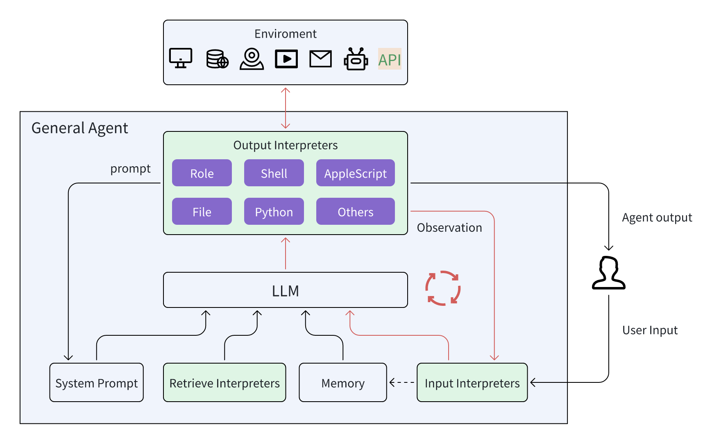

<h1 align="center">GeneralAgent: From LLM to Agent</h1>
<p align="center">
<a href="README.md"></a>
<a href="README_CN.md"></a>

</p>
<p align='center'>
A simple, general, customizable Agent framework
</p>




## Features

* From LLM to Agent
    * Let a single LLM knows everything what's happening.
    * thoughts become actions in nature and immediately.
    * receive the information from the outside world, and then decide what to do immediately.
* GPT-3.5 run stably
* Support customization by customizing interpreters, role system prompt and tools.
* Support serialization.
* Build-in interpreters: Python, AppleScript, Shell, File, Plan, Retrieve etc.


## Demo

https://github.com/CosmosShadow/GeneralAgent/assets/13933465/9d9b4d6b-0c9c-404d-87d8-7f8e03f3772b


## Installation

install from pip:

```bash
pip install GeneralAgent
```

install from source code:

```shell
git clone https://github.com/CosmosShadow/GeneralAgent
cd GeneralAgent
python setup.py install
```


## Usage

### Terminal

```bash
GeneralAgent
```

Optional parameters:

```shell
GeneralAgent --workspace ./test --new --auto_run
# worksapce: Set workspace directory, default ./general_agent
# new: if workspace exists, create a new workspace, like ./general_agent_2023xxx
# auto_run: if auto_run, the agent will run the code automatically, default no
```


### Python

#### Empty Agent

[examples/empty_agent.py](examples/empty_agent.py)

empty agent, only role interpreter and memory, work like a basic LLM chatbot.

```python
import asyncio
from GeneralAgent.agent import Agent

async def main():
    agent = Agent.empty()
    while True:
        input_content = input('>>>')
        await agent.run(input_content)

if __name__ == '__main__':
    asyncio.run(main())
```


#### Default Agent

[examples/default_agent.py](examples/default_agent.py)

```python
import asyncio
from GeneralAgent.agent import Agent

async def main():
    agent = Agent.default()
    while True:
        input_content = input()
        await agent.run(input_content)

if __name__ == '__main__':
    asyncio.run(main())
```


#### Customize Interpreter
[examples/custom.py](examples/custom.py)

```python
import re
import asyncio
from GeneralAgent.agent import Agent
from GeneralAgent.interpreter import Interpreter
from GeneralAgent.utils import confirm_to_run

python_prompt = """
# Run python
* Remember use print() to output
* format is : ```python\\nthe_code\\n```
* the code will be executed
* python version is 3.9
"""

class BasicPythonInterpreter(Interpreter):
    @property
    def match_template(self) -> bool:
        return  r'```python\n([\s\S]*)\n```'

    def parse(self, string) -> (str, bool):
        pattern = re.compile(self.match_template, re.DOTALL)
        code = pattern.search(string).group(1)
        if confirm_to_run():
            exec(code)
        return '' , False

    def prompt(self, messages) -> str:
        return python_prompt

    def output_match(self, string) -> bool:
        super().match(string)


async def main():
    agent = Agent(output_interpreters=[BasicPythonInterpreter()])
    while True:
        input_content = input('>>>')
        await agent.run(input_content)

if __name__ == '__main__':
    asyncio.run(main())
```


#### Customize output
[examples/custom_output.py](examples/custom_output.py)

```python
import asyncio
from GeneralAgent.agent import Agent

async def custom_output(token):
    if token is None:
        print('[output end]')
    else:
        print(token, end='', flush=True)

async def main():
    agent = Agent.default('./basic')
    while True:
        input_content = input('>>>')
        await agent.run(input_content, output_callback=custom_output)

if __name__ == '__main__':
    asyncio.run(main())
```


#### Customize system prompt

The default system prompt defined by RoleInterpreter at [GeneralAgent/interperters/role_interperter.py](GeneralAgent/interperters/role_interperter.py)

```python
"""
Now: {{now}}
You are GeneralAgent, a agent on the {{os_version}} computer to help the user solve the problem.
Remember, you can control the computer and access the internet.
Solve the task step by step if you need to. If a plan is not provided, explain your plan first simply and clearly.
You can use the following skills to help you solve the problem directly without explain and ask for permission: 
"""
```

You can custom the system prompt like this

```python
RoleInterpreter(system_prompt='xxxx')
```

or inherit RoleInterpreter to custom your own system prompt


#### Add tools to agent

[examples/add_tools.py](examples/add_tools.py)

This is a example.
Define a tool to get the weather of a city in [examples/tool_get_weather.py](examples/tool_get_weather.py)

```python
def get_weather(city:str):
    """
    get weather from city
    """
    return 'weather is good, sunny.'
```

Then, add the tool to the PythonInterperter, The Agent will use the tool in python interpreter automatically.

Attetion, the PythonInterperter and the current program are not in the same namespace, so you need to import the tool in the PythonInterperter by customize a import_code.

```python
import asyncio
from GeneralAgent.tools import Tools
from GeneralAgent.agent import Agent
from GeneralAgent.interpreter import PythonInterpreter
from tool_get_weather import get_weather

import_code = """
import os, sys, math
from tool_get_weather import get_weather
"""

async def main():
    workspace = './'
    tools = Tools([get_weather])
    python_interpreter = PythonInterpreter(tools=tools, import_code=import_code)
    agent = Agent(workspace, input_interpreters=[], output_interpreters=[python_interpreter])
    while True:
        input_content = input('>>>')
        await agent.run(input_content)

if __name__ == '__main__':
    asyncio.run(main())
```

```
[lichen@examples]$ python add_tools.py
>>>what's the weather of chengdu?

To get the weather of Chengdu, we can use the `get_weather` function provided in the prompt. Here's the code to get the weather of Chengdu:

\`\`\`python
weather = get_weather('Chengdu')
print(weather)
\`\`\`


weather is good, sunny.

Glad to hear that the weather in Chengdu is good and sunny! Is there anything else I can help you with?
>>>Is there anything else I can help you with?
>>>
```


#### Agent Serialization

All the status of the agent is saved in the workspace directory in real time and only needs to be reloaded.

```python
agent = Agent.default(workspace='./test')
await agent.run('Hi, My Name is Chen Li').


agent = None
agent = Agent.default(workspace('./test'))
await agent.run('What is my Name?')
# expect to output Chen Li
```

## Configuration

Configure Agent by enviroment variables defined in ([.env.example](.env.example))

```shell
# Configure OpenAI API Key
export OPENAI_API_KEY='xx'

# OpenAI Request URL
export OPENAI_API_BASE='https://api.openai.com/v1'
# MLL Model, defualt gpt-3.5-turbo
export OPENAI_API_MODEL='gpt-3.5-turbo'
# model temperature, default 0.5
TEMPERATURE=0.5

# cache llm inference and embedding, useful when develop and debug
export LLM_CACHE='no' # otherwise yes
export LLM_CACHE_PATH='./llm_cache.json'

# google search tool at https://google.serper.dev
export SERPER_API_KEY='xxx'

# Whether to automatically run python, shell, applescript and other codes
# Default no: n
export AUTO_RUN='y' # y or n

```

## Join us

wechat 

<p align="center">

</p>

discord is comming soon.